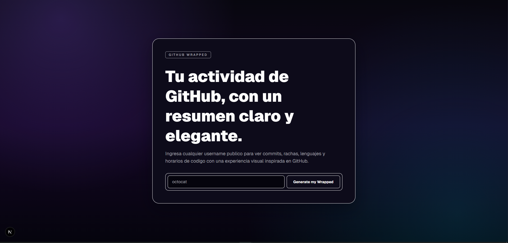

# GitHub Wrapped

> A visual, shareable yearly recap of any public GitHub profile.


Built with Next.js App Router, Octokit, Framer Motion, and dynamic OG image generation.

## Screenshot



## Preview vibe

- `Dark GitHub-inspired UI` with subtle depth and clean borders.
- `Smooth transitions` for card navigation (keyboard, arrows, swipe).
- `Share-ready output` through PNG export + dynamic OG images.

## What this app does

- 🔎 Search any public GitHub username from the landing page.
- ⚙️ Fetch profile + repository activity server-side.
- 📊 Compute yearly stats (commits, top languages, streaks, schedule, top repo).
- 🎞️ Present results as animated cards with carousel navigation.
- 🖼️ Export cards as PNG and share on social platforms.
- 🌐 Generate dynamic Open Graph previews at `/api/og/[username]`.

## Stack

| Layer | Tech |
|---|---|
| Framework | `next` (App Router, TypeScript) |
| Styling | `tailwindcss` v4 |
| Data/API | `octokit` |
| Animation | `framer-motion` |
| Export | `html-to-image` |
| Social Preview | `@vercel/og` |

## Architecture

The project follows a clean split between data, domain logic, and presentation.

```text
Browser UI
   │
   ├─ app/page.tsx + UsernameInput
   │
   ▼
app/[username]/page.tsx (server)
   │
   ├─ lib/github.ts  -> GitHub REST API (Octokit)
   └─ lib/stats.ts   -> Wrapped metrics
   │
   ▼
CardCarousel + Cards + ShareButtons
   │
   └─ /api/og/[username] -> Dynamic OG image
```

### 1) Data layer (`lib/github.ts`)

- Responsible for all GitHub API communication.
- Uses Octokit with optional `GITHUB_TOKEN` auth.
- Fetches:
  - User profile
  - Public repositories
  - Public events
  - Repo languages
  - Commit activity stats
  - Authored commits per repo (bounded for latency/rate safety)
- Handles API failures with domain-specific errors:
  - `GitHubUserNotFoundError`
  - `GitHubRateLimitError`

### 2) Domain/statistics layer (`lib/stats.ts`)

- Converts raw API payloads into Wrapped-friendly metrics.
- Calculates:
  - `totalCommits`
  - `topLanguages` (top 3 + percentages)
  - `codingSchedule` (madrugada/manana/tarde/noche)
  - `longestStreak`
  - `topRepo`
  - `summary`
- Uses fallback strategy to avoid empty cards when one source is missing.

### 3) UI layer (`app/` + `components/`)

- Server-rendered route: `app/[username]/page.tsx`
  - Fetches data and computes stats server-side.
  - Handles not-found/rate-limit/error states.
  - Provides dynamic metadata per username.
- Client-interactive components:
  - `CardCarousel` (swipe/arrows/keyboard navigation)
  - `ShareButtons` (download + social share)
  - `UsernameInput` (landing form + routing)
- Presentational card components live under `components/cards/`.

### 4) Social preview layer (`app/api/og/[username]/route.tsx`)

- Dynamic image generation through `ImageResponse` from `next/og`.
- Pulls real user data and key Wrapped stats.
- Produces share-friendly image for Twitter/LinkedIn embeds.

## Project structure

```text
github-wrapped/
  app/
    page.tsx
    [username]/
      page.tsx
      loading.tsx
      error.tsx
    api/og/[username]/route.tsx
  components/
    UsernameInput.tsx
    CardCarousel.tsx
    ShareButtons.tsx
    cards/
      CardShell.tsx
      TotalCommitsCard.tsx
      TopLanguagesCard.tsx
      CodingScheduleCard.tsx
      LongestStreakCard.tsx
      TopRepoCard.tsx
      SummaryCard.tsx
  lib/
    github.ts
    stats.ts
    types.ts
  public/fonts/
    Geist-Regular.ttf
```

## Data flow

1. User submits username on `/`.
2. App navigates to `/[username]`.
3. Server route fetches raw GitHub data via `lib/github.ts`.
4. Stats are computed in `lib/stats.ts`.
5. Cards are rendered and animated in `CardCarousel`.
6. Share actions export card images or open social intents.
7. Metadata points to `/api/og/[username]` for dynamic previews.

## Quickstart

```bash
pnpm install
cp .env.example .env.local
pnpm dev
```

Then open `http://localhost:3000`.

## Environment

Copy `.env.example` to `.env.local` and set values as needed:

```bash
GITHUB_TOKEN=
NEXT_PUBLIC_APP_URL=http://localhost:3000
```

- `GITHUB_TOKEN` is optional, but highly recommended for higher API rate limits.

## Build and quality checks

```bash
pnpm lint
pnpm build
pnpm start
```

## Testing essentials

- Landing input -> route navigation to `/[username]`
- Server data load + graceful error states
- Card carousel interactions (buttons, keys, swipe)
- Share actions (PNG export + social intents)
- OG endpoint response at `/api/og/[username]`

## Notes and limits

- Only public GitHub activity is available.
- Private repos/contributions are not included.
- For very high-activity users, commit fetching is intentionally bounded to keep responses fast.

## Future improvements

- Add caching strategy (per-user, short TTL) to reduce repeated API calls.
- Add confidence indicators for partial/limited data.
- Add year selector for historical Wrapped views.

## OpenCode, Skills, and MCP example

This repository is also an example of building with an AI coding workflow powered by OpenCode, Skills, and MCP integrations.

- `OpenCode`: used as the coding agent to implement and iterate on the app architecture, UI, and server logic.
- `Skills`: reusable capability packs (for example, frontend design guidance) loaded during development to apply specialized patterns.
- `MCP` (Model Context Protocol): tool bridge used to access external capabilities such as:
  - `Context7` for up-to-date framework/library documentation
  - `TestSprite` for structured testing workflows

In short, this project demonstrates how to combine:

- Strong product-focused implementation (Next.js app)
- Structured AI assistance (OpenCode + Skills)
- Tool-augmented engineering workflows (MCP providers)

to ship a production-grade frontend application faster.

---

If you liked this project, feel free to fork it and create your own yearly developer story. ✨
